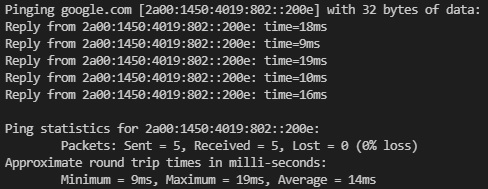

# Pyng

A Python implementation of Ping command.

## Example

```bash
py pyng.py google.com -n 5 -6
```



## To run

1.  ### Clone the repository

    ```bash
    git clone https://github.com/abhinavgeethan/Ping
    ```

2.  ### Run

    ```bash
    py pyng.py <hostname>
    ```

    You may be required to run as administrator.
    If you don't have Python installed visit the [official website](https://www.python.org/downloads/).

    #### Usage

    ```bash
    pyng.py [-h] [-t | -n count] [-i TTL] [-w timeout] [-l size] [-4 | -6] Destination_Host
    ```

## Options

     -h, --help         show this help message and exit
     -t                 Ping host until stopped. To stop enter: CTRL+C
     -n count           Number of echo requests to send. Default is 4.
     -i TTL, --ttl TTL  Specify (TTL) Time To Live of packets sent. IPv4 only.
     -w timeout         Timeout in milliseconds to wait for each reply. Default is 1000.
     -l size            Send buffer size. Default is 32.
     -4                 Force ping to use IPv4 protocol. [Default]
     -6                 Force ping to use IPv6 protocol.

To report bugs visit the [issues](https://github.com/abhinavgeethan/Ping/issues) tab.
