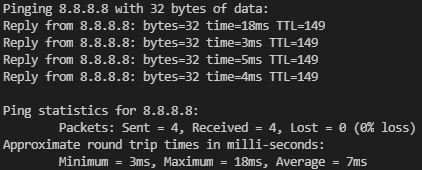

# Ping

A python implementation of Ping command.



## To run

1.  ### Clone the repository

    ```bash
    git clone https://github.com/abhinavgeethan/Ping
    ```

2.  ### Run

    ```bash
    py main.py
    ```

To report bugs visit the [issues](https://github.com/abhinavgeethan/Ping/issues) tab.
